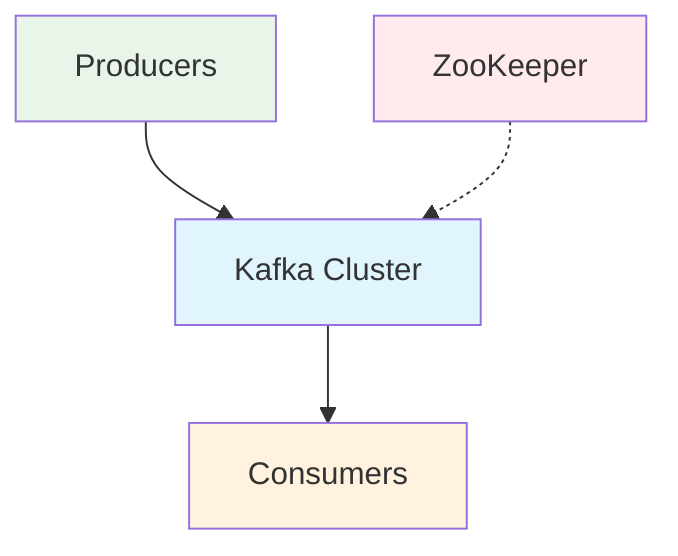
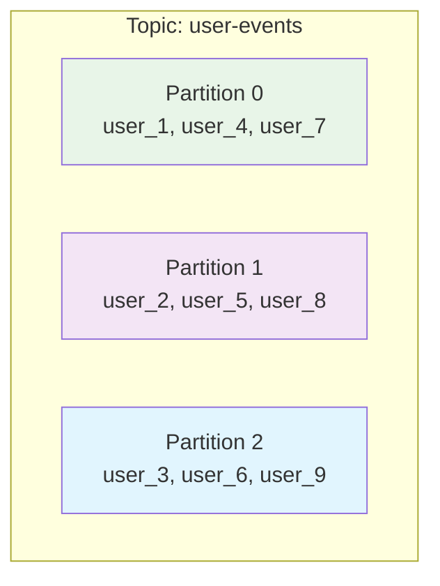
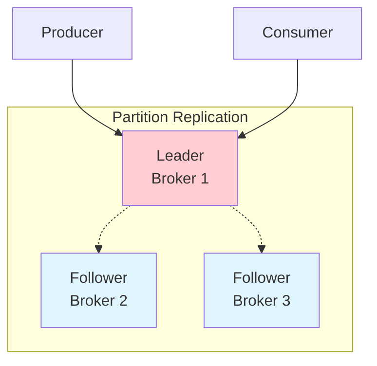
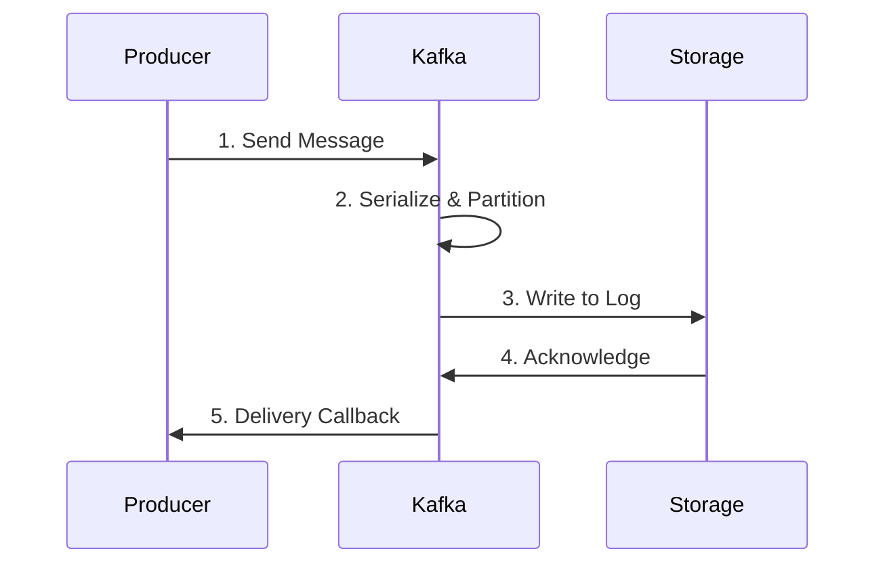
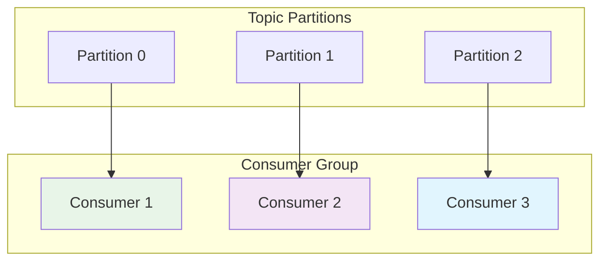

# Kafka Architecture Fundamentals

## What is Apache Kafka?

Apache Kafka is a distributed streaming platform designed for building real-time data pipelines and streaming applications. It functions as a distributed commit log that can handle high-throughput data feeds.

## High-Level Architecture Overview



## Core Components

### 1. Broker
- A Kafka server that stores and serves data
- Each broker is identified by a unique ID
- Production clusters typically have 3+ brokers for fault tolerance
- Brokers handle read/write requests and manage data replication

### 2. Topic
- A logical channel or category where messages are published
- Topics are divided into partitions for scalability
- Examples: "user-events", "payment-transactions", "sensor-data"

### 3. Partition
- A subset of a topic that provides parallelism
- Each partition is an ordered, immutable sequence of messages
- Messages within a partition are ordered by offset
- Partitions enable horizontal scaling and parallel processing



### 4. Producer
- Applications that publish/write messages to Kafka topics
- Can specify which partition to write to
- Handles message batching and compression
- Provides delivery guarantees through configuration

### 5. Consumer
- Applications that subscribe to and read messages from topics
- Can be part of a consumer group for load balancing
- Tracks position (offset) in each partition
- Supports both real-time and batch processing patterns

### 6. Consumer Group
- A group of consumers working together to consume a topic
- Each partition is consumed by only one consumer in the group
- Provides automatic load balancing and fault tolerance
- Enables horizontal scaling of message processing

### 7. Offset
- A unique identifier for each message within a partition
- Monotonically increasing integer (0, 1, 2, ...)
- Consumers track their position using offsets
- Enables replay and exactly-once processing

### 8. ZooKeeper (Traditional) / KRaft (Modern)
- **ZooKeeper**: Distributed coordination service for Kafka metadata
- **KRaft**: Kafka's new built-in consensus protocol (replacing ZooKeeper)
- Manages broker membership, topic configuration, and partition leadership

## Key Architecture Principles

### 1. Distributed Design
```
Broker 1    Broker 2    Broker 3
├─ Topic A  ├─ Topic A  ├─ Topic A
│  Part 0   │  Part 1   │  Part 2
├─ Topic B  ├─ Topic B  ├─ Topic B
│  Part 0   │  Part 1   │  Part 2
```

### 2. Replication
- Each partition has one leader and multiple followers
- Replication factor determines number of copies
- Only leader handles read/write operations
- Followers replicate data for fault tolerance



### 3. Partitioning Strategy
```
Topic: user-events (3 partitions)
┌─────────────┬─────────────┬─────────────┐
│ Partition 0 │ Partition 1 │ Partition 2 │
├─────────────┼─────────────┼─────────────┤
│ user_1      │ user_2      │ user_3      │
│ user_4      │ user_5      │ user_6      │
│ user_7      │ user_8      │ user_9      │
└─────────────┴─────────────┴─────────────┘
```

## Message Flow

### 1. Producer Flow
```
Producer → [Serialize] → [Partition] → [Batch] → Broker
```

1. Producer creates a message
2. Message is serialized (JSON, Avro, etc.)
3. Partitioner determines target partition
4. Message is added to batch for efficiency
5. Batch is sent to appropriate broker



### 2. Consumer Flow
```
Broker → [Fetch] → [Deserialize] → [Process] → Consumer
```

1. Consumer polls broker for new messages
2. Messages are fetched in batches
3. Messages are deserialized
4. Application processes the messages
5. Consumer commits offset to track progress

## Guarantees and Semantics

### 1. Ordering Guarantees
- **Within Partition**: Messages are strictly ordered
- **Across Partitions**: No ordering guarantee
- **Global Ordering**: Use single partition (limits scalability)

### 2. Delivery Semantics
- **At Most Once**: Messages may be lost, never duplicated
- **At Least Once**: Messages never lost, may be duplicated
- **Exactly Once**: Messages delivered exactly once (ideal)

### 3. Durability
- Messages are persisted to disk
- Configurable retention period (time or size-based)
- Replication provides fault tolerance

## Storage Model

### 1. Log-based Storage
```
Partition File Structure:
├── 00000000000000000000.log  (messages 0-999)
├── 00000000000001000000.log  (messages 1000-1999)
├── 00000000000002000000.log  (messages 2000-2999)
└── ...
```

### 2. Segment Management
- Partitions are split into segments
- Old segments can be deleted based on retention policy
- Active segment receives new messages

### 3. Indexing
- Offset index for fast message lookup
- Time index for time-based queries
- Efficient binary search within segments

## Performance Characteristics

### 1. Throughput
- Sequential I/O for high performance
- Batch processing reduces overhead
- Zero-copy optimization for data transfer
- Can handle millions of messages per second

### 2. Latency
- Sub-millisecond latency possible
- Configurable based on consistency requirements
- Trade-off between throughput and latency

### 3. Scalability
- Horizontal scaling through partitions
- Linear scalability with proper partitioning
- Independent scaling of producers and consumers

## Consumer Group Behavior



## Use Cases

### 1. Event Streaming
- Real-time event processing
- User activity tracking
- System monitoring and alerting

### 2. Data Integration
- ETL pipelines
- Database change capture
- Microservices communication

### 3. Message Queuing
- Decoupling of systems
- Asynchronous processing
- Load balancing across consumers

This architecture enables Kafka to handle massive scale while providing strong durability and performance guarantees.