# Kafka Architecture Fundamentals (Enhanced with Visual Diagrams)

## What is Apache Kafka?

Apache Kafka is a distributed streaming platform designed for building real-time data pipelines and streaming applications. It functions as a distributed commit log that can handle high-throughput data feeds.

## Core Components Overview

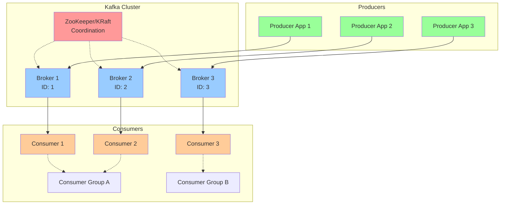

## Detailed Component Architecture

### 1. Broker Architecture

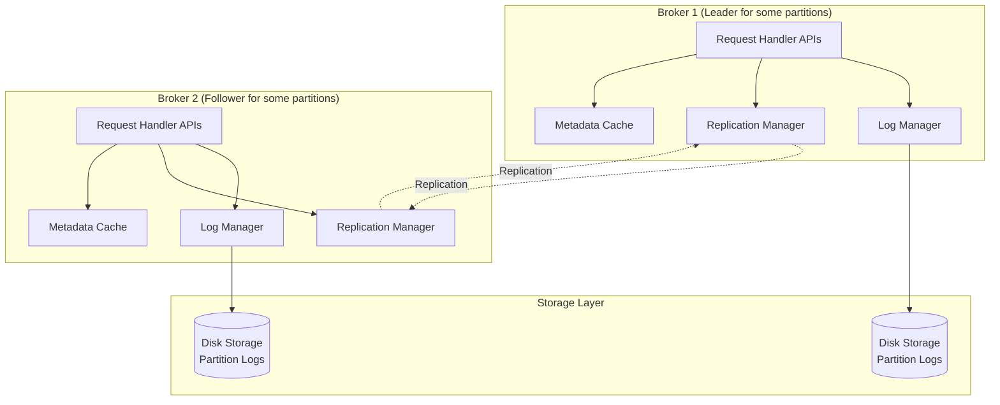

### 2. Topic and Partition Structure

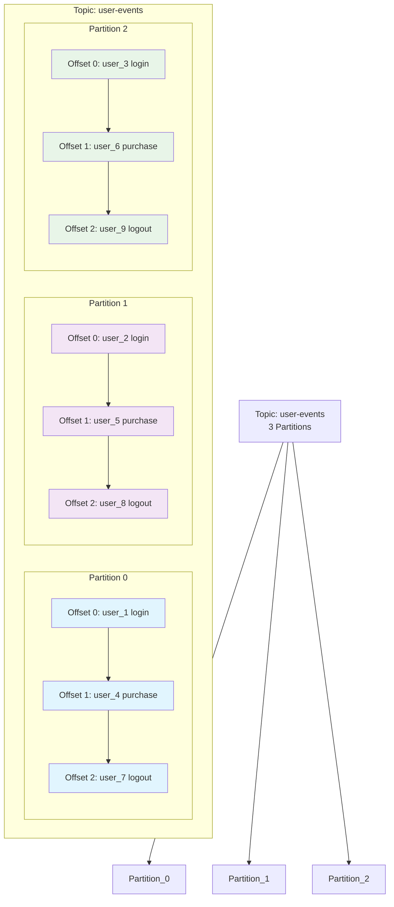

## Key Architecture Principles

### 1. Distributed Design with Replication

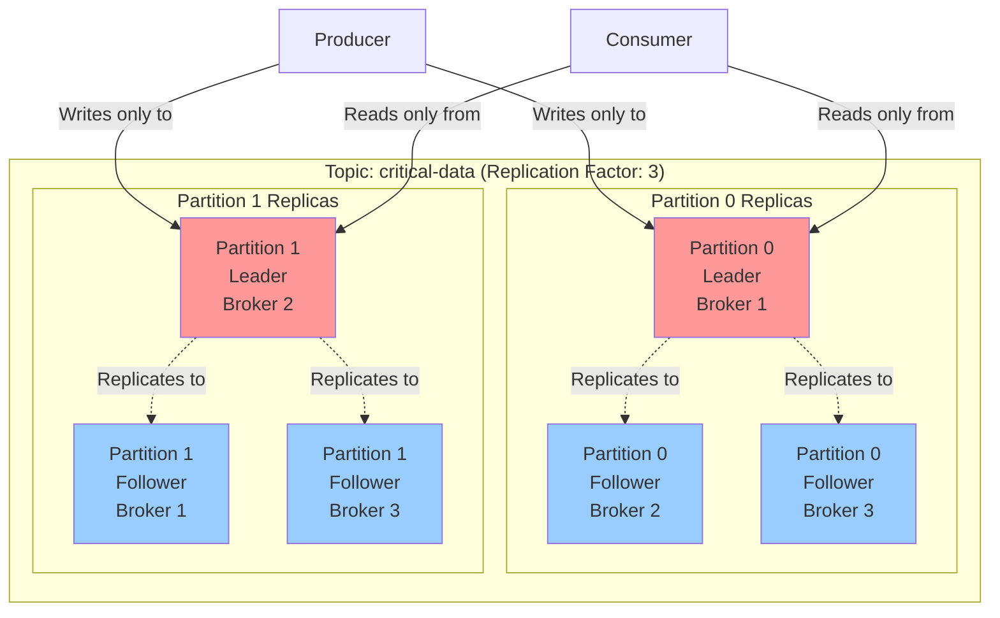

### 2. Partitioning Strategy

```mermaid
flowchart TD
    MSG[Message with Key]

    subgraph "Partitioning Logic"
        KEY{Has Key?}
        HASH[Hash Function<br/>hash(key) % partitions]
        RR[Round Robin<br/>Distribute evenly]
    end

    subgraph "Partitions"
        P0[Partition 0<br/>user_1, user_4, user_7]
        P1[Partition 1<br/>user_2, user_5, user_8]
        P2[Partition 2<br/>user_3, user_6, user_9]
    end

    MSG --> KEY
    KEY -->|Yes| HASH
    KEY -->|No| RR

    HASH --> P0
    HASH --> P1
    HASH --> P2

    RR --> P0
    RR --> P1
    RR --> P2

    style KEY fill:#fff2cc
    style HASH fill:#d5e8d4
    style RR fill:#f8cecc
```

## Message Flow Architecture

### 1. Producer Message Flow

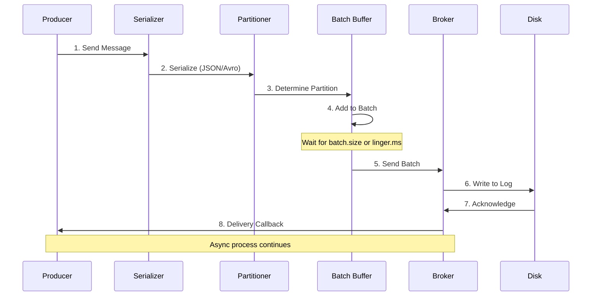

### 2. Consumer Message Flow

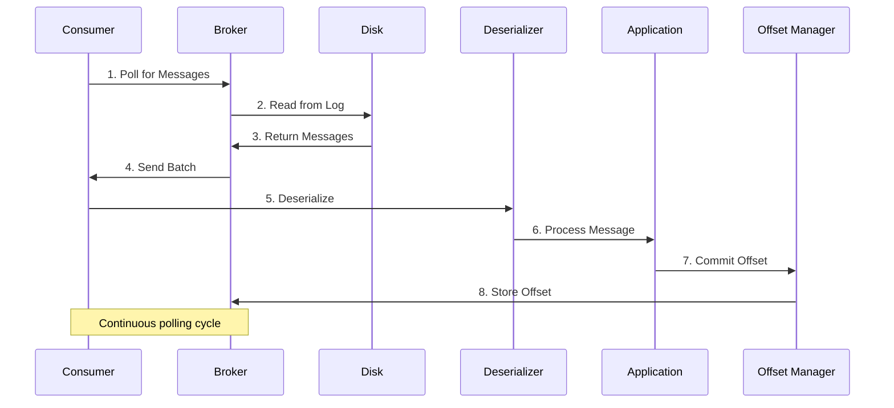

## Consumer Group Rebalancing

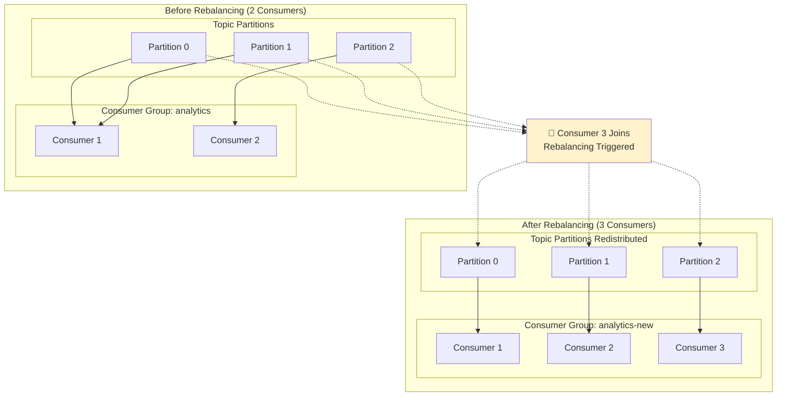

## Storage Architecture

### 1. Log Segment Structure

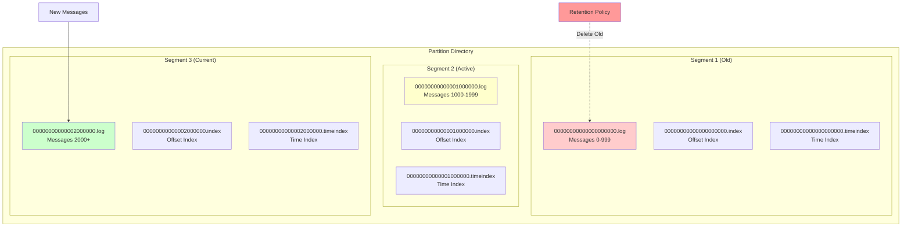

### 2. Message Structure

```mermaid
graph TD
    subgraph "Kafka Message Format"
        subgraph "Message Header"
            OFFSET[Offset: 12345]
            TIMESTAMP[Timestamp: 1704067200000]
            KEY_SIZE[Key Size: 8 bytes]
            VALUE_SIZE[Value Size: 256 bytes]
        end

        subgraph "Message Payload"
            KEY[Key: "user_123"]
            VALUE[Value: JSON/Avro Data]
            HEADERS[Headers: source=mobile, version=1.0]
        end

        subgraph "Metadata"
            PARTITION[Partition: 1]
            CHECKSUM[CRC32 Checksum]
        end
    end

    OFFSET --> KEY
    KEY --> VALUE
    VALUE --> HEADERS

    style OFFSET fill:#e1f5fe
    style KEY fill:#f3e5f5
    style VALUE fill:#e8f5e8
    style HEADERS fill:#fff3e0
```

## Performance and Scalability

### 1. Throughput Optimization

```mermaid
graph LR
    subgraph "Producer Optimizations"
        BATCH[Batching<br/>batch.size=16KB]
        COMPRESS[Compression<br/>snappy/lz4]
        ASYNC[Async Send<br/>callbacks]
    end

    subgraph "Broker Optimizations"
        ZEROCOPY[Zero Copy<br/>sendfile()]
        SEQUENTIAL[Sequential I/O<br/>Append Only]
        PAGECACHE[Page Cache<br/>OS Level]
    end

    subgraph "Consumer Optimizations"
        FETCHSIZE[Fetch Size<br/>fetch.min.bytes]
        PREFETCH[Prefetching<br/>Multiple partitions]
        PARALLEL[Parallel Processing<br/>Multiple consumers]
    end

    BATCH --> ZEROCOPY
    COMPRESS --> SEQUENTIAL
    ASYNC --> PAGECACHE

    ZEROCOPY --> FETCHSIZE
    SEQUENTIAL --> PREFETCH
    PAGECACHE --> PARALLEL

    style BATCH fill:#99ff99
    style ZEROCOPY fill:#99ccff
    style FETCHSIZE fill:#ffcc99
```

## Delivery Semantics

```mermaid
graph TD
    subgraph "At Most Once"
        AMO_PROD[Producer: acks=0<br/>No wait for confirmation]
        AMO_CONS[Consumer: Auto-commit<br/>before processing]
        AMO_RESULT[Result: May lose messages<br/>Never duplicates]

        AMO_PROD --> AMO_CONS --> AMO_RESULT
    end

    subgraph "At Least Once"
        ALO_PROD[Producer: acks=all<br/>Wait for replicas]
        ALO_CONS[Consumer: Commit after<br/>processing]
        ALO_RESULT[Result: Never lose messages<br/>May have duplicates]

        ALO_PROD --> ALO_CONS --> ALO_RESULT
    end

    subgraph "Exactly Once"
        EO_PROD[Producer: Idempotent<br/>enable.idempotence=true]
        EO_TRANS[Transactions<br/>Atomic commits]
        EO_RESULT[Result: Exactly once<br/>No loss, no duplicates]

        EO_PROD --> EO_TRANS --> EO_RESULT
    end

    style AMO_RESULT fill:#ffcccc
    style ALO_RESULT fill:#ffffcc
    style EO_RESULT fill:#ccffcc
```

## Use Case Patterns

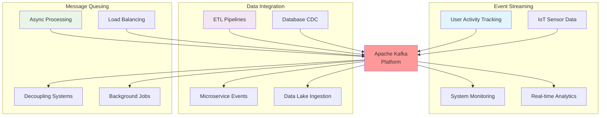

## Fault Tolerance and High Availability

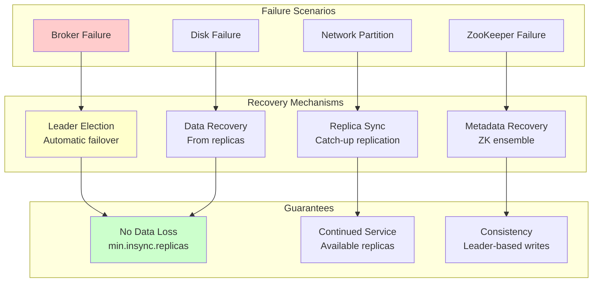

This enhanced architecture documentation with Mermaid diagrams provides a comprehensive visual understanding of Kafka's core concepts, making it much more engaging and easier to understand for your intern and the broader community!