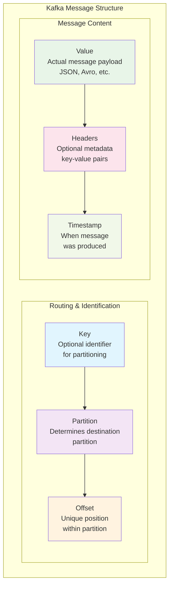
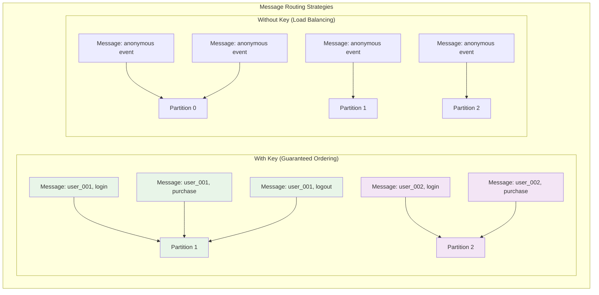

# Tutorial 2: Your First Kafka Producer and Consumer

## Learning Objectives

After completing this tutorial, you will:
- Understand the anatomy of a Kafka message
- Write a production-ready Python producer
- Implement a reliable Python consumer
- Handle serialization and deserialization
- Understand message keys and partitioning

## Message Anatomy

Every Kafka message consists of several components that work together:



### Key Components:
- **Key**: Optional identifier for message routing
- **Value**: The actual message payload
- **Partition**: Determined by key hash or round-robin
- **Offset**: Unique position within partition
- **Timestamp**: When message was produced
- **Headers**: Optional metadata (key-value pairs)

## Building Your First Producer

### Step 1: Basic Producer Structure

Create a new file: `src/producers/basic_producer.py`

```python
#!/usr/bin/env python3
"""
Basic Kafka Producer Example
Demonstrates fundamental producer concepts
"""
import json
import time
from typing import Dict, Any, Optional
from confluent_kafka import Producer, KafkaError


class BasicProducer:
    """Simple Kafka producer for learning purposes"""

    def __init__(self, bootstrap_servers: str = 'localhost:9092'):
        """
        Initialize the producer with basic configuration

        Args:
            bootstrap_servers: Comma-separated list of broker addresses
        """
        self.config = {
            'bootstrap.servers': bootstrap_servers,
            'client.id': 'basic-producer',

            # Reliability settings
            'acks': 'all',  # Wait for all replicas to acknowledge
            'retries': 3,   # Retry failed sends
            'retry.backoff.ms': 100,

            # Performance settings
            'batch.size': 16384,  # Batch size in bytes
            'linger.ms': 5,       # Wait up to 5ms to batch messages
            'compression.type': 'snappy',  # Compress messages
        }

        self.producer = Producer(self.config)
        print(f"Producer initialized with brokers: {bootstrap_servers}")

    def send_message(self,
                    topic: str,
                    value: Dict[str, Any],
                    key: Optional[str] = None) -> bool:
        """
        Send a single message to Kafka

        Args:
            topic: Target topic name
            value: Message payload (will be JSON serialized)
            key: Optional message key for partitioning

        Returns:
            bool: True if message sent successfully
        """
        try:
            # Serialize the message value to JSON
            serialized_value = json.dumps(value)

            # Produce the message
            self.producer.produce(
                topic=topic,
                value=serialized_value,
                key=key,
                callback=self._delivery_callback
            )

            # Poll for delivery events (non-blocking)
            self.producer.poll(0)

            return True

        except Exception as e:
            print(f"Error sending message: {e}")
            return False

    def _delivery_callback(self, err: Optional[KafkaError], msg):
        """
        Callback function called when message delivery completes

        Args:
            err: Error object if delivery failed
            msg: Message object with delivery details
        """
        if err is not None:
            print(f"Message delivery failed: {err}")
        else:
            print(f"Message delivered to partition {msg.partition()} "
                  f"at offset {msg.offset()}")

    def flush_and_close(self):
        """
        Ensure all messages are sent and close the producer
        """
        print("Flushing remaining messages...")
        remaining = self.producer.flush(timeout=10)

        if remaining > 0:
            print(f"Warning: {remaining} messages not delivered")
        else:
            print("All messages delivered successfully")


# Example usage and testing
if __name__ == "__main__":
    # Create producer instance
    producer = BasicProducer()

    # Sample data to send
    sample_messages = [
        {
            'user_id': 'user_001',
            'action': 'login',
            'timestamp': time.time(),
            'ip_address': '192.168.1.100'
        },
        {
            'user_id': 'user_002',
            'action': 'purchase',
            'product_id': 'prod_123',
            'amount': 29.99,
            'timestamp': time.time()
        },
        {
            'user_id': 'user_001',
            'action': 'logout',
            'timestamp': time.time()
        }
    ]

    topic_name = 'user-events'

    print(f"Sending {len(sample_messages)} messages to topic '{topic_name}'")
    print("-" * 50)

    # Send each message
    for i, message in enumerate(sample_messages):
        # Use user_id as key for consistent partitioning
        key = message.get('user_id')

        success = producer.send_message(
            topic=topic_name,
            value=message,
            key=key
        )

        if success:
            print(f"Queued message {i+1}")
        else:
            print(f"Failed to queue message {i+1}")

        # Small delay between messages
        time.sleep(0.1)

    # Ensure all messages are sent
    producer.flush_and_close()
    print("Producer example completed!")
```

### Step 2: Understanding Producer Configuration

#### Reliability Settings:
- **acks='all'**: Wait for all replicas to acknowledge (strongest durability)
- **retries=3**: Retry failed sends automatically
- **enable.idempotence=True**: Prevent duplicate messages

#### Performance Settings:
- **batch.size**: Batch messages for efficiency
- **linger.ms**: Wait time to form larger batches
- **compression.type**: Reduce network usage

## Building Your First Consumer

### Step 3: Basic Consumer Structure

Create a new file: `src/consumers/basic_consumer.py`

```python
#!/usr/bin/env python3
"""
Basic Kafka Consumer Example
Demonstrates fundamental consumer concepts
"""
import json
import signal
import sys
from typing import List, Optional
from confluent_kafka import Consumer, KafkaError


class BasicConsumer:
    """Simple Kafka consumer for learning purposes"""

    def __init__(self,
                 topics: List[str],
                 group_id: str,
                 bootstrap_servers: str = 'localhost:9092'):
        """
        Initialize the consumer

        Args:
            topics: List of topics to subscribe to
            group_id: Consumer group identifier
            bootstrap_servers: Comma-separated list of broker addresses
        """
        self.topics = topics
        self.running = True

        self.config = {
            'bootstrap.servers': bootstrap_servers,
            'group.id': group_id,
            'client.id': f'{group_id}-client',

            # Offset management
            'auto.offset.reset': 'earliest',  # Start from beginning if no offset
            'enable.auto.commit': False,      # Manual offset commit for reliability

            # Session management
            'session.timeout.ms': 30000,     # 30 seconds
            'heartbeat.interval.ms': 10000,  # 10 seconds
            'max.poll.interval.ms': 300000,  # 5 minutes

            # Performance settings
            'fetch.min.bytes': 1,            # Minimum bytes to fetch
            'fetch.max.wait.ms': 500,        # Max wait time for min bytes
        }

        self.consumer = Consumer(self.config)
        print(f"Consumer initialized for group: {group_id}")
        print(f"Subscribed to topics: {topics}")

    def start_consuming(self):
        """
        Start the main consumer loop
        """
        # Set up signal handlers for graceful shutdown
        signal.signal(signal.SIGINT, self._signal_handler)
        signal.signal(signal.SIGTERM, self._signal_handler)

        try:
            # Subscribe to topics
            self.consumer.subscribe(self.topics)
            print("Starting consumer loop...")
            print("Press Ctrl+C to stop")
            print("-" * 50)

            while self.running:
                # Poll for messages
                msg = self.consumer.poll(timeout=1.0)

                if msg is None:
                    continue

                if msg.error():
                    self._handle_error(msg.error())
                    continue

                # Process the message
                self._process_message(msg)

        except Exception as e:
            print(f"Unexpected error: {e}")
        finally:
            self._cleanup()

    def _process_message(self, msg):
        """
        Process a single message

        Args:
            msg: Kafka message object
        """
        try:
            # Extract message details
            topic = msg.topic()
            partition = msg.partition()
            offset = msg.offset()
            key = msg.key()
            value = msg.value()
            timestamp = msg.timestamp()

            # Deserialize JSON value
            if value:
                data = json.loads(value.decode('utf-8'))
            else:
                data = None

            # Print message details
            print(f"Received message:")
            print(f"  Topic: {topic}")
            print(f"  Partition: {partition}")
            print(f"  Offset: {offset}")
            print(f"  Key: {key}")
            print(f"  Timestamp: {timestamp}")
            print(f"  Data: {data}")
            print("-" * 30)

            # Simulate message processing
            self._business_logic(data)

            # Commit offset after successful processing
            self.consumer.commit(msg)

        except json.JSONDecodeError as e:
            print(f"JSON decode error: {e}")
            # Handle poison messages appropriately

        except Exception as e:
            print(f"Error processing message: {e}")
            # In production, might want to send to dead letter queue

    def _business_logic(self, data):
        """
        Simulate business logic processing

        Args:
            data: Deserialized message data
        """
        if not data:
            return

        # Example: Process different types of user events
        action = data.get('action')
        user_id = data.get('user_id')

        if action == 'login':
            print(f"  📝 User {user_id} logged in")
        elif action == 'purchase':
            amount = data.get('amount', 0)
            print(f"  💰 User {user_id} made purchase: ${amount}")
        elif action == 'logout':
            print(f"  👋 User {user_id} logged out")
        else:
            print(f"  ❓ Unknown action: {action}")

    def _handle_error(self, error):
        """
        Handle consumer errors

        Args:
            error: KafkaError object
        """
        if error.code() == KafkaError._PARTITION_EOF:
            # End of partition - not really an error
            print("Reached end of partition")
        else:
            print(f"Consumer error: {error}")

    def _signal_handler(self, signum, frame):
        """
        Handle shutdown signals gracefully
        """
        print(f"\nReceived signal {signum}, shutting down...")
        self.running = False

    def _cleanup(self):
        """
        Clean up resources
        """
        print("Closing consumer...")
        self.consumer.close()
        print("Consumer closed successfully")


# Example usage
if __name__ == "__main__":
    # Consumer configuration
    topics = ['user-events']
    group_id = 'tutorial-consumer-group'

    # Create and start consumer
    consumer = BasicConsumer(
        topics=topics,
        group_id=group_id
    )

    consumer.start_consuming()
```

## Running Your Producer and Consumer

### Step 4: Test Your Implementation

1. **Start the consumer first**:
```bash
# Make sure you're in the project root and virtual environment is active
cd /home/spurge/tutorials/kafka
source .venv/bin/activate

# Create the topic if it doesn't exist
docker exec -it kafka-broker kafka-topics \
  --bootstrap-server localhost:9092 \
  --topic user-events \
  --create \
  --partitions 3 \
  --replication-factor 1 \
  --if-not-exists

# Run the consumer
python src/consumers/basic_consumer.py
```

2. **In a new terminal, run the producer**:
```bash
# Activate virtual environment
cd /home/spurge/tutorials/kafka
source .venv/bin/activate

# Run the producer
python src/producers/basic_producer.py
```

### Expected Output

**Consumer Output**:
```
Consumer initialized for group: tutorial-consumer-group
Subscribed to topics: ['user-events']
Starting consumer loop...
Press Ctrl+C to stop
--------------------------------------------------
Received message:
  Topic: user-events
  Partition: 1
  Offset: 0
  Key: b'user_001'
  Timestamp: (1, 1704067200000)
  Data: {'user_id': 'user_001', 'action': 'login', 'timestamp': 1704067200.0, 'ip_address': '192.168.1.100'}
  📝 User user_001 logged in
------------------------------
```

**Producer Output**:
```
Producer initialized with brokers: localhost:9092
Sending 3 messages to topic 'user-events'
--------------------------------------------------
Queued message 1
Message delivered to partition 1 at offset 0
Queued message 2
Message delivered to partition 0 at offset 0
Queued message 3
Message delivered to partition 1 at offset 1
Flushing remaining messages...
All messages delivered successfully
Producer example completed!
```

## Key Concepts Explained

### Message Keys and Partitioning



**Key Benefits:**
1. **With Key**: Messages with the same key go to the same partition
   - Ensures ordering for related messages
   - Example: All events for `user_001` in same partition

2. **Without Key**: Round-robin distribution across partitions
   - Better load balancing
   - No ordering guarantees

### Consumer Groups

Consumer groups enable horizontal scaling and fault tolerance:

- **Parallel Processing**: Multiple consumers work together to process a topic
- **Partition Assignment**: Each partition is assigned to exactly one consumer in the group
- **Load Balancing**: Work is automatically distributed across available consumers
- **Fault Tolerance**: If a consumer fails, its partitions are reassigned to other consumers
- **Rebalancing**: Automatic redistribution when consumers join or leave the group

**Key Rules**:
- One partition → One consumer (within a group)
- Multiple consumers can consume the same partition (different groups)
- More consumers than partitions = some consumers will be idle

### Offset Management

Offsets track consumer progress and enable different delivery semantics:

**Auto-commit vs Manual commit**:
- **Auto-commit (`enable.auto.commit=True`)**:
  - Convenient for simple use cases
  - Risk of message loss if consumer crashes after commit but before processing
  - Risk of duplicate processing if consumer crashes after processing but before commit

- **Manual commit (`enable.auto.commit=False`)**:
  - More control over exactly when offsets are committed
  - Commit after successful processing for at-least-once delivery
  - Commit before processing for at-most-once delivery

**Offset Reset Strategies**:
- **earliest**: Start from the beginning of the topic
- **latest**: Start from the most recent messages
- **none**: Throw error if no committed offset exists

## Delivery Semantics and Patterns

### Message Delivery Guarantees

**At-Most-Once Delivery**:
- Messages may be lost but never duplicated
- Commit offset before processing message
- If consumer crashes after commit but before processing → message lost
- Use case: Metrics, logs where occasional loss is acceptable

**At-Least-Once Delivery**:
- Messages are never lost but may be duplicated
- Process message, then commit offset
- If consumer crashes after processing but before commit → message reprocessed
- Use case: Most business applications (handle duplicates in application logic)

**Exactly-Once Delivery**:
- Messages are neither lost nor duplicated
- Requires transactional producers and idempotent consumers
- Complex but provides strongest guarantees
- Use case: Financial transactions, critical business processes

### Producer Patterns

**1. Fire-and-Forget Pattern**:
```python
# Fastest but least reliable
producer.produce(topic, value=message)
# Don't wait for acknowledgment
```

**2. Synchronous Send Pattern**:
```python
# Reliable but slower
producer.produce(topic, value=message)
producer.flush()  # Wait for all messages to be sent
```

**3. Asynchronous Send with Callbacks**:
```python
# Balance of performance and reliability
def delivery_callback(err, msg):
    if err:
        # Handle error (retry, log, etc.)
        handle_error(err, msg)
    else:
        # Message delivered successfully
        log_success(msg)

producer.produce(topic, value=message, callback=delivery_callback)
```

### Consumer Patterns

**1. Simple Polling Loop**:
```python
while True:
    msg = consumer.poll(timeout=1.0)
    if msg and not msg.error():
        process_message(msg)
        consumer.commit(msg)  # Manual commit
```

**2. Batch Processing**:
```python
messages = []
while len(messages) < batch_size:
    msg = consumer.poll(timeout=0.1)
    if msg and not msg.error():
        messages.append(msg)

# Process entire batch
process_batch(messages)
# Commit only the last message in batch
consumer.commit(messages[-1])
```

**3. Error Handling with Retry**:
```python
def process_with_retry(msg, max_retries=3):
    for attempt in range(max_retries):
        try:
            process_message(msg)
            consumer.commit(msg)
            return
        except RetryableError:
            if attempt == max_retries - 1:
                send_to_dead_letter_queue(msg)
            else:
                time.sleep(2 ** attempt)  # Exponential backoff
```

### Error Handling Best Practices

**1. Distinguish Error Types**:
- **Transient errors**: Network issues, temporary service unavailability
- **Poison messages**: Malformed data that will always fail
- **Business logic errors**: Valid message but business rule violation

**2. Retry Strategies**:
- **Immediate retry**: For very transient issues
- **Exponential backoff**: For system overload situations
- **Dead letter queue**: For messages that repeatedly fail

**3. Circuit Breaker Pattern**:
```python
class CircuitBreaker:
    def __init__(self, failure_threshold=5, timeout=60):
        self.failure_count = 0
        self.failure_threshold = failure_threshold
        self.timeout = timeout
        self.last_failure_time = None
        self.state = 'CLOSED'  # CLOSED, OPEN, HALF_OPEN

    def call_service(self, func, *args, **kwargs):
        if self.state == 'OPEN':
            if time.time() - self.last_failure_time > self.timeout:
                self.state = 'HALF_OPEN'
            else:
                raise CircuitBreakerOpenException()

        try:
            result = func(*args, **kwargs)
            self.reset()
            return result
        except Exception as e:
            self.record_failure()
            raise e
```

### Performance Optimization

**Producer Optimizations**:
- **Batching**: Use `batch.size` and `linger.ms` to group messages
- **Compression**: Enable `compression.type` (snappy, lz4, gzip)
- **Async sending**: Don't wait for each message acknowledgment
- **Connection pooling**: Reuse producer instances

**Consumer Optimizations**:
- **Fetch sizing**: Tune `fetch.min.bytes` and `fetch.max.wait.ms`
- **Parallel processing**: Use multiple consumers in same group
- **Memory management**: Process and commit in reasonable batch sizes
- **Connection management**: Monitor session timeouts and heartbeats

## Next Steps

Now that you understand basic producers and consumers:

1. **Practice**: Modify the code to handle different message types
2. **Experiment**: Try different configuration options
3. **Scale**: Run multiple consumers in the same group
4. **Monitor**: Use Kafka UI to observe message flow

In the next tutorial, we'll cover:
- Advanced serialization (Avro, Schema Registry)
- Error handling and retry strategies
- Performance optimization techniques
- Production deployment considerations